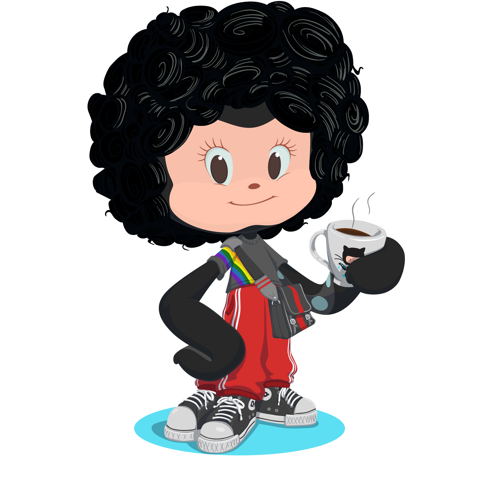

<!-- CABEÇALHO -->

<!-- SOBRE MIM -->

  
  
 
  

  - Meus pronomes são ela/dela 👩‍💻
  - Atualmente estou estudando Desenvolvimento Web na [Trybe](https://www.betrybe.com/) 🚀
  - Me considero escritora por amor (de textos e códigos) 💗
  - Minha cor favorita é <strong>rosa</strong> 🧠
  - Sou apaixonada por gatinhos 🐈
  - Não gosto muito de café, mas bebo diariamente ☕ 
  - Gosto de ler e de colecionar livros 📚
  - Amo jogos (meus favoritos são Sudoku, Nonogramas, Campo Minado, Enigma de Einsten... e Minecraft) 🎮
  - Sou artesã no meu tempo livre 🧶
 

<!-- TECNOLOGIAS -->

  

  
   
  
  
  
  
  
  
  
  
  
  
  
  
  
  
  
  
  
  
  

<!-- ESTATÍSTICAS -->

  

  
   
   
  
   
   
  
   
   
  

<!-- CONTATOS -->

  

  
   
  
  
  

<!-- RODAPÉ -->

